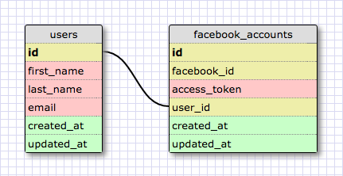

# Schema Design: One-to-one Schema 

## Summary
If we haven't done so already, it's recommended to complete the [one-to-many schema design challenge][] before completing this challenge.

Modeling a one-to-one relationship in a database schema is similar to a one-to-many relationship: we connect the primary key from one table to a foreign key field in another table.

When do we declare a one-to-one association instead of a one-to-many?  When we associate two types of objects and we want to limit an object of Type A and an object of Type B to being associated exclusively with each other.

If we think about a human body, we could say that each body has one liver and that each liver belongs to one body.  If a transplant takes place, the body receiving the liver doesn't keep its old liver and the transplanted liver.  Instead, the body continues to have one liver: the association with the old liver is broken and is replaced by the association with the transplanted liver.  In the same way, the transplanted liver doesn't belong to both its old body and the new body; it belongs to the new body. (Forgive any medical inaccuracies in this generalization.)

It can be difficult to see when to set up a one-to-one relationship between objects instead of a one-to-many.  A web application-related example is a site that optionally allows each user to connect a Facebook account.  A user has one connected Facebook account, and each connected Facebook account belongs to one user (see Figure 1).

  
*Figure 1*.  Modeling a one-to-one relationship between users and connected Facebook accounts.

In this example, the `users` table itself could include the Facebook-related fields (i.e., `facebook_id` and `access_token`).  When do we know when to use a separate table?  Here's the rule of thumb: if we have a logical grouping of fields which can all optionally be `NULL`, it's a good idea to split those fields out into a separate table in a one-to-one relationship. In this case, if a user never connects a Facebook account, all Facebook-related fields would be `NULL`, so we move them to a separate table.

*Note:* In the schema designer, a one-to-one relationship looks just like a one-to-many relationship.  The difference occurs in the models and in possible constraints placed on the database tables.

##Releases

###Release 0 : Design the schema

Use [Schema Designer][] to create your schema.  Model the relationship between the <code>users</code> and <code>facebook&#95;accounts</code>.

When you are done, take a screenshot of your schema, commit it, and issue a pull request.

##Resources

* [Schema Designer](http://schemadesigner.devbootcamp.com/)

[one-to-many schema design challenge]: ../../../../database-drill-one-to-many-schema-challenge
[Schema Designer]: http://schemadesigner.devbootcamp.com/
